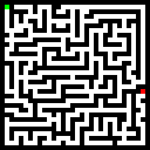
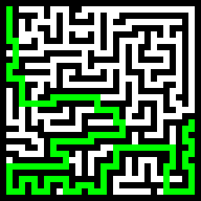

# Maze Solver

#### Overview
Maze solver is a python script that solves mazes.
It uses [Breadth-first Search](https://en.wikipedia.org/wiki/Breadth-first_search) algorithm to solve the maze
and [Pillow](https://pypi.org/project/Pillow) library to load the maze and save the solution.
Input is a pixel art of a maze.

#### Usage

#### Example

###### Input

###### Output
